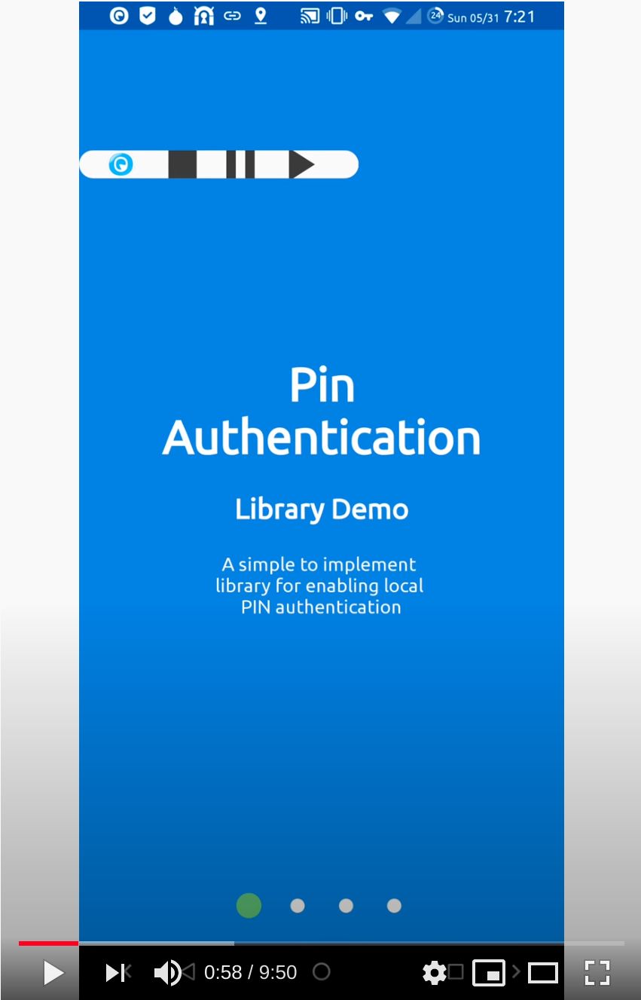

# PinAuthentication 
An Android library that provides local PIN authentication for your application.

 

When your application is brought to the foreground, PinAuthentication will
check if authentication is required. If so, it will automatically launch an Activity
requiring the user to enter their PIN. A correct PIN will remove the Authentication
Activity and return to the prior Activity for which it was started from.

## [Get started!](get_started.md)

## Other Projects Using It
<!-- Example (copy between the brackets [] below): -->
<!-- [- <a href="https://your.project.website.com" target="_blank">Your Project's Name</a>] -->

!!! Info
    Add your project to the list by submitting a PR!  
    Edit <a href="https://github.com/05nelsonm/pin-authentication/blob/master/docs/index.md" target="_blank">This Document</a>

## License <a href="https://github.com/05nelsonm/pin-authentication/blob/master/LICENSE" target="_blank">:material-link-box-variant-outline:</a>

Copyright &copy; 2020  Matthew Nelson

This program is free software: you can redistribute it and/or modify
it under the terms of the GNU General Public License as published by
the Free Software Foundation, either version 3 of the License, or
(at your option) any later version.

This program is distributed in the hope that it will be useful,
but WITHOUT ANY WARRANTY; without even the implied warranty of
MERCHANTABILITY or FITNESS FOR A PARTICULAR PURPOSE.  See the
GNU General Public License for more details.

You should have received a copy of the GNU General Public License along
with this program.  If not, see <a href="https://www.gnu.org/licenses/gpl-3.0.html" target="_blank">here</a>.
